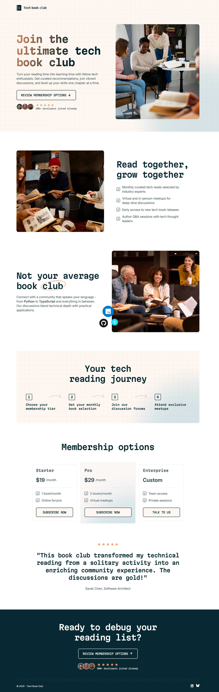

# Frontend Mentor - Tech book club landing page solution

This is a solution to the [Tech book club landing page challenge on Frontend Mentor](https://www.frontendmentor.io/challenges/tech-book-club-landing-page-fZQidjHU73). Frontend Mentor challenges help you improve your coding skills by building realistic projects. 

This project features a clean design asthetic and showcases a number of modern development techniques, including responsiveness across multiple screen sizes, efficient use of CSS Grid and Flexbox layout techniques, and extensive CSS nesting and layers to produce more modular styles.

## Table of contents

- [Overview](#overview)
  - [The challenge](#the-challenge)
  - [Screenshot](#screenshot)
  - [Links](#links)
- [My process](#my-process)
  - [Built with](#built-with)
  - [What I learned](#what-i-learned)
  - [Continued development](#continued-development)
  - [Useful resources](#useful-resources)
- [Author](#author)

## Overview

### The challenge

Users should be able to:

- View the optimal layout for the interface depending on their device's screen size
- See hover and focus states for all interactive elements on the page

### Screenshot




### Links

- [Frontend Mentor Solution Page](https://www.frontendmentor.io/solutions/responsive-landing-page-using-css-grid-and-flexbox--NoSDnPJCd)
- [Live site URL](https://darling-blini-2a2475.netlify.app/)

## My process

### Built with

- Semantic HTML5 markup
- CSS custom properties
- Flexbox
- CSS Grid
- Mobile-first workflow
- Accessible development best practices

### What I learned

I was drawn to this project mainly due to its clean design and the variety of layout techniques it was bound to require. While lately, I spend most of my development time working with React, I really enjoy coming back to design projects that are focused solely on implementing foundational HTML and CSS. 

With this project, I set out to make accessibility a priority, implementing proper semantic HTML elements, setting ARIA roles and attributes where appropriate, and taking care to handle featured images and icons properly. Adhering to A11Y standards and practices is a personal priority for me moving forward and I tried to build a foundation with that approach here.

I've had a preference to use inline svg files for a while now, but I can recognize now that I've often missed some simple but critical accessibility-related details. In this project, I looked to ensure both `title` and `aria-hidden` attributes were present where necessary, specifically with the decorative elements and social network icons.

```html
<svg
  aria-hidden="true"
  xmlns="http://www.w3.org/2000/svg"
  width="24"
  height="25"
  fill="none"
  viewBox="0 0 24 25">
  <title>star</title>
  <path
    fill="#FF9A60"
    d="M11.207 5.742c.328-.656 1.258-.629 1.559 0L14.57 9.38l3.992.574c.711.11.985.985.465 1.504l-2.87 2.816.683 3.965c.11.711-.656 1.258-1.285.93L12 17.281l-3.582 1.887c-.629.328-1.395-.219-1.285-.93l.683-3.964-2.87-2.817c-.52-.52-.247-1.394.464-1.504l4.02-.574 1.777-3.637Z"
    opacity=".9" />
</svg>
```

I utilized locally scoped variables, data attributes for styling, and CSS nesting frequently for this project, certainly more so than in many of my previous HTML/CSS-only projects. These reusable classes proved tremendously useful throughout and are directly inspired by similar utility classes showcased in Kevin Powell's recent Frontend Masters course project (linked below).

```css
.wrapper {
    --wrapper-max-width: 1170px;
    --padding-inline: var(--spacing-400);
    margin-inline: auto;
    width: min(
      100% - var(--padding-inline),
      var(--wrapper-max-width)
    );

    @media (width > 40rem) {
      --padding-inline: var(--spacing-800);
    }

    &[data-width='medium'] {
      --wrapper-max-width: 970px;
    }
  }

  .equal-columns {
    display: grid;
    gap: var(--equal-columns-gap, var(--spacing-300));
    align-items: var(--column-layout-alignment, start);

    &[data-gap='medium'] {
      --equal-columns-gap: var(--spacing-500);
    }

    &[data-gap='large'] {
      --equal-columns-gap: var(--spacing-800);
    }

    @media (width > 64rem) {
      --column-layout-alignment: center;
      grid-auto-flow: column;

      &[data-gap='medium'] {
        --equal-columns-gap: var(--spacing-1000);
      }
    }
  }
```

### Continued development

As mentioned above, it was a point of emphasis for me to keep accessibility in mind throughout much of the development process. I'm sure I've certainly missed some opportunities to improve accessibility along the way here, but adopting even a collection of baseline standards feels like a good foundation to build on. Moving forward, inclusive design and development will be a significant priority for me and a skillset I'm enthusiastic to improve upon.

### Useful resources

- [Totally Custom List Styles](https://moderncss.dev/totally-custom-list-styles/) - I drew a lot from this Stephanie Eckles post when styling the custom list items for the site. I opted to go with the `::before` pseudo-element route rather than the newer `::marker` pseudo selector, mainly for better support across browsers (though I recognize this method could present some accessibility problems I'll need to evaluate further).
- [Professional CSS: Build a Website from Scratch](https://frontendmasters.com/courses/pro-css/) - I undertook this project right on the heels of watching Kevin Powell's excellent course over at Frontend Masters. I drew a lot of inspiration for my CSS from concepts discussed during the class. 


## Author

- Website - [Matt Pahuta](https://www.mattpahuta.com)
- Frontend Mentor - [@mattpahuta](https://www.frontendmentor.io/profile/MattPahuta)
- Bluesky - [@mattpahuta](https://bsky.app/profile/mattpahuta.bsky.social)
- LinkedIn - [Matt Pahuta](www.linkedin.com/in/mattpahuta)